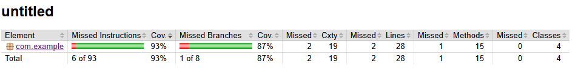
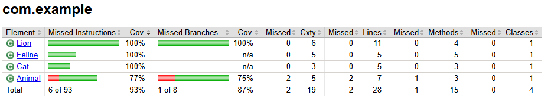

# Sprint_6 / qa_java

## Описание
Тебя пригласили помочь зоологам: они исследуют семейство кошачьих. Чтобы записывать наблюдения, учёные используют специальную программу. Тебе предстоит протестировать часть программы.
Загляни в шпаргалки, чтобы вспомнить материал спринта.
Чтобы увеличить покрытие, нужно вызвать каждый метод каждого класса в отдельном тесте. Для каждой ветки условия напиши отдельный тест. Некоторым веткам понадобится параметризованный тест.
Проект состоит из обязательного и дополнительного заданий. Дополнительное задание не влияет на оценку, но поможет получить больше опыта.

## Задание:
- Собери Maven-проект: подключи Jacoco, Mockito и JUnit.
- Класс Lion не должен зависеть от класса Feline. Используй принцип инъекции зависимостей.
- Напиши моки с помощью Mockito. Какие именно понадобятся — определи самостоятельно.
- Напиши тесты на классы Feline, Cat и Lion.
- Подумай, где можно применить параметризацию. Реализуй параметризованные тесты.
- Оцени покрытие с помощью Jacoco: оно должно быть не менее 100% для классов Feline, Cat и Lion..

## Покрытие
Детальную информацию о покрытии можно посмотреть в [./target/site/jacoco](https://github.com/nanekostanyan/qa_java/tree/main/target/site/jacoco)/index.html.

Полное покрытие Animal по заданию не требуется.
